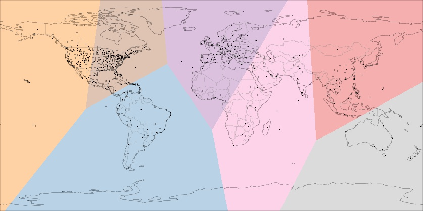

# Geographic Puzzle - A detective's work


The premise of this analysis is *every dataset tells a story*. This is a great invitation to dive into the dataset open-minded and explore it  wherever it might take you. Probably, the most interesting and fun way of putting those great data science skills to use. Without further ado, here are the instructions to follow the story the data has told me so far. Feel free to continue my story or use this to guide your own story afresh.

1. Clone or download the repo
2. Install the conda environment (non-python dependencies...) from the *environment.yaml* file:
```
conda env create --name yourEnvName --file=environment.yaml
```
3. Activate the environment
```
conda activate yourEnvName
```
4. Open jupyter lab
```
>> jupyter lab
```
5. Run the code on *SampleAnalysis.ipynb* and enjoy!
